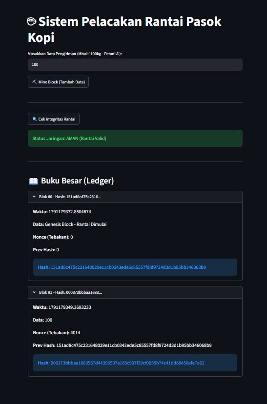

# 📚Praktikum 4 Blockchain Pertemuan 5 (TUGAS) #

### Tujuan Praktikum ###
1. Mahasiswa memahami konsep Mempool dan mekanisme validasi transaksi sebelum masuk ke dalam blok.
2. Mahasiswa mampu mengimplementasikan algoritma Proof of Work (PoW) pada struktur Blockchain lokal.
3. Mahasiswa memahami fungsi Nonce (Number Only Used Once) dan Difficulty dalam proses mining.
4. Mahasiswa mampu memvalidasi integritas rantai secara keseluruhan menggunakan skrip Python.

### Konsep Dasar Proof of Work (PoW) ###
Pada pertemuan sebelumnya, blok dapat ditambahkan secara instan. Di dunia nyata (seperti Bitcoin), menambahkan blok membutuhkan "pengorbanan" komputasi agar jaringan terhindar dari spam. Proses ini disebut Mining.
Sistem akan menetapkan sebuah target (Difficulty), misalnya: Hash blok harus diawali dengan 3 buah angka nol (000...).
Karena fungsi Hash bersifat acak, penambang (miner) harus terus-menerus menebak angka acak bernama Nonce sampai menemukan Hash yang sesuai target.

### Hasil Pengujian Aplikasi ###
Pengujian dilakukan langsung melalui antarmuka Streamlit untuk memverifikasi dua kondisi utama sistem:
