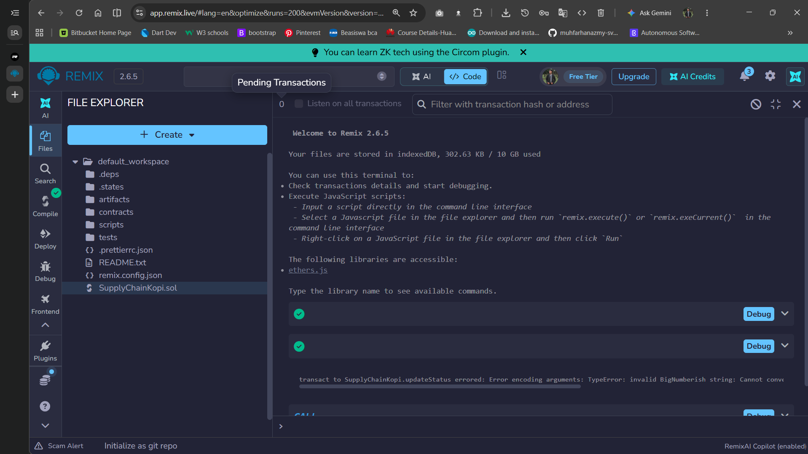
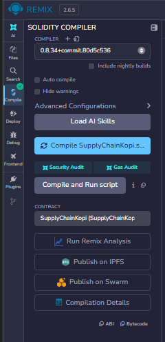
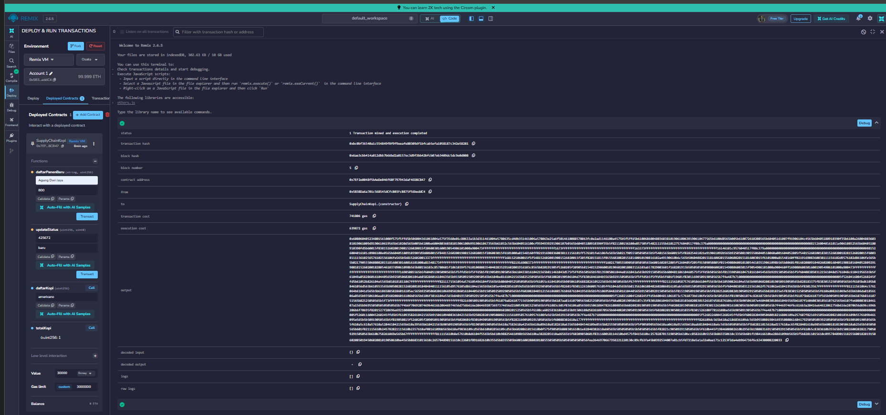
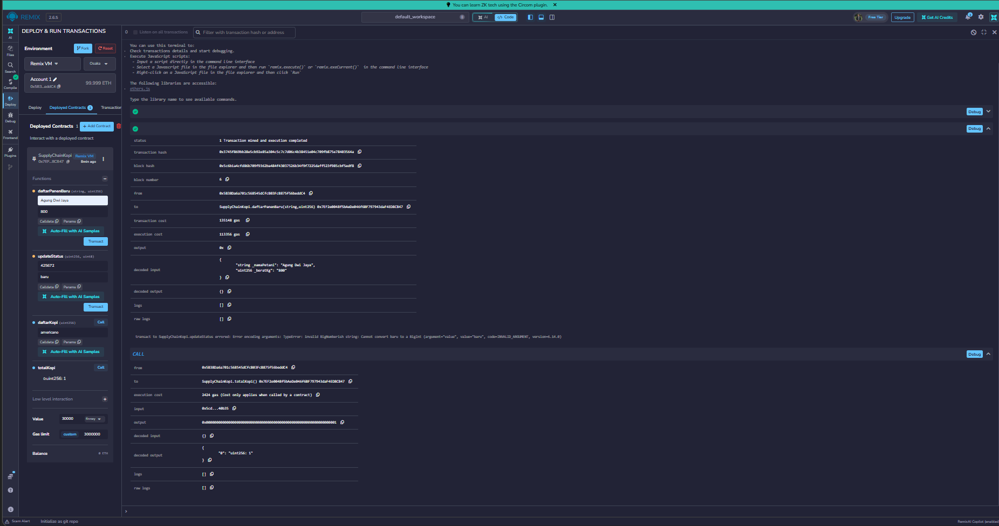

# Praktikum 6: membuat smart contract dengan solidity di remix #

# Tujuan Pembelajaran #
setelah menyelesaikan praktikum ini, mahasiswa diharapkan mampu:
1. memahami konsep dasar dari smart contract pada blockchain.
2. menggunakan platfrom remix untuk menuulis, mengompilasi, dan men-deploy smart contract berbasis solidity. 
3. mengimplementasikan fungsionalitas dasar smart contract yang melibatkan state variable dan fungsi.
4. melakukan interaksi dengan smart contract yang sudah ter-deploy melalui remix.

### Proses Praktikum ###
1. Buka [remix IDE] (https://remix.ethereum.org/) login via gmail, bukti

2. Buat file baru di files dengan nama file SupplyChainKopi.sol
isi koding sesuai dengan modul

3. lakukan kompilasi dengan menekan tombol disamping kiri

4. Deploy smart contract ke blockchain

